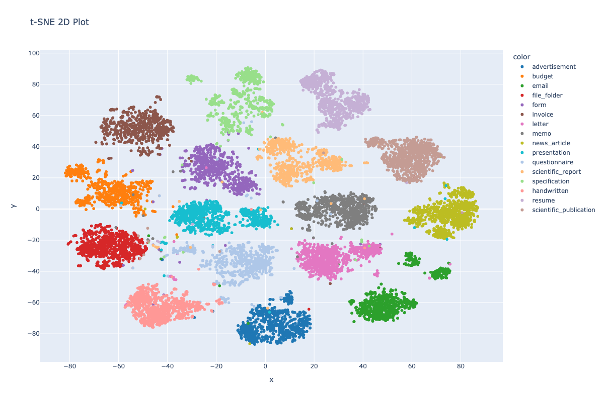

## Embedding of Documents using an LLM Model

Model: https://github.com/clovaai/donut

Document dataset: https://adamharley.com/rvl-cdip/ 

In cooperation with Uni Rostock

Using LLM to create Embedding of documents, by utilizing document appearance and text, to create embedding to perform document classification

